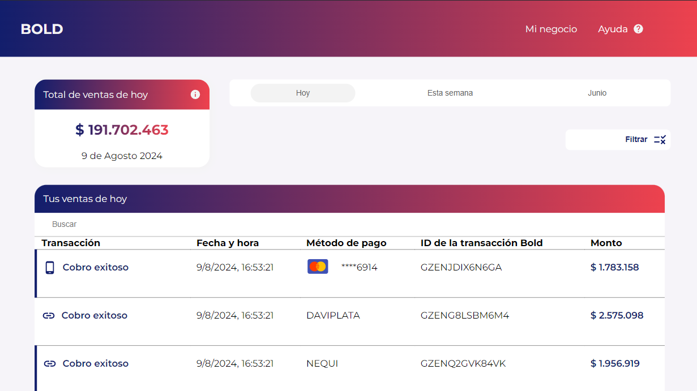
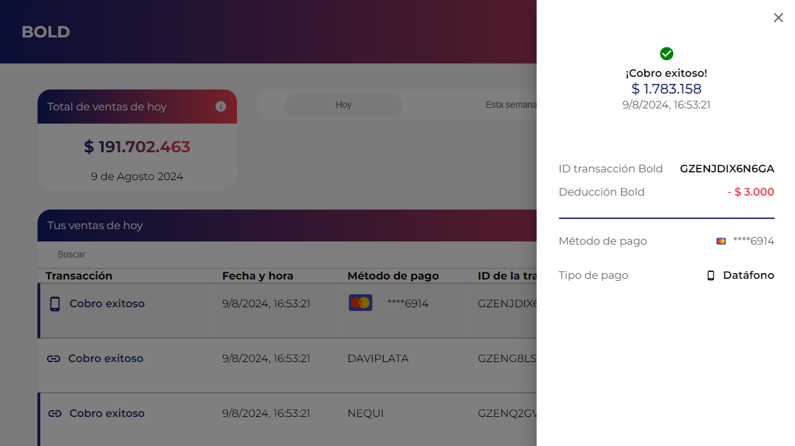
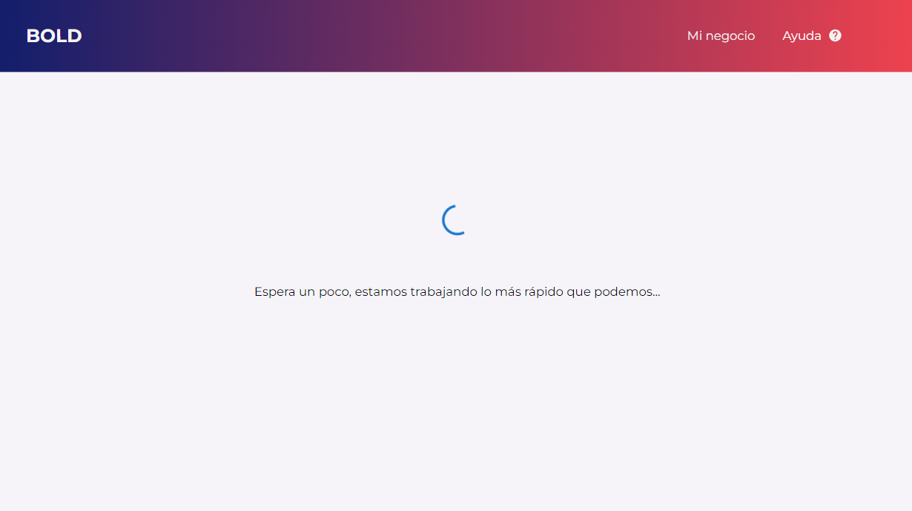

# Bold dashboard

## Table of contents
* [General info](#general-info)
* [Demo](#demo)
* [App](#app)
* [Technologies](#technologies)
* [Setup](#setup)

---

## General info
This repository contains my e-commerce web application.

I am doing this project primarily to solve a technical test, and to a greater extent to continue improving my knowledge of frontend development.

The user can see a record of sales for their business in different time periods.

The user can select between viewing sales on the day they make the query, the last week or in the month of June. In addition to being able to filter the data shown in other categories.


### Objective
Develop a dashboard that lists the transactions made in a business, allowing you to review the details of each transaction as well as perform filters by date and by type of transaction and search by any parameter in the table.

### Criteria

* Design:
Implement the image-based design.
Use the Monserrat font.
Make the design responsive.
Use any CSS framework or pure CSS.
Implement tooltips.
Display a drawer for each of the transactions when selecting them.
Follow the color scheme.

* JS Interaction:
The following endpoint must be consumed: https://bold-fe-api.vercel.app/api to display the information.
The user can select the “Today” or “This Week” or “June” button
(when the button is selected, it is displayed with a gray background color
as it appears in the design) and the title of the table and the card is changed.
The user can also select one or more checkboxes within the “Filter” button tooltip.
Once the user clicks on any of these buttons or checkboxes
the table is updated and displays the corresponding information.
The user can search for any parameter in the table through the
search engine.
The current filters must be persisted.


### Development
The dashboard was developed following the designs as closely as possible with HTML, CSS, and MaterialUI and meeting the design and functionality criteria with filters and persistence of data.

It was developed following good development practices, making the code as scalable as possible by developing it with TypeScript, and through functional and reusable components.

React was used as the development language, accompanied by HTML and CSS technologies. The Material UI CSS framework was also used.
React was used for convenience and taking into account that it is the main language in the stack in the offer.
Pure CSS was mostly used as it allows for convenience and freedom in the implementation of specific styles, thus approaching similarity with the design to follow.
Material UI was used to implement some already developed components such as the base Drawer and some icons, speeding up development times. This framework allows for great ease of installation and implementation with React.


* Plus:
- A loading was developed as a measure for waiting for the return of data from the API call.
- The application was deployed through github with github-pages.

### Possible improvements.

Implement test cases, unit tests or E2E.
Improve SEO.
Implement authentication.
Implement more animations to improve UX.

## Demo
Here is a deployed app : https://martincorredor.github.io/bold-dashboard


## App




	
## Technologies
This project is created with:
* React
* TypeScript
* JavaScript
* HTML
* CSS
* Material UI
* Github Pages (deploy and hosting)

## Setup
To run this project, after cloning my repository, install it locally using npm:

```
$ cd bold-dashboard
$ npm install
$ npm start
```
---
Thanks for your visit

## Author
* **Martin Corredor** - [martincorredor](https://github.com/martincorredor)

## [License]

MIT © [Martin Corredor](https://github.com/martincorredor)